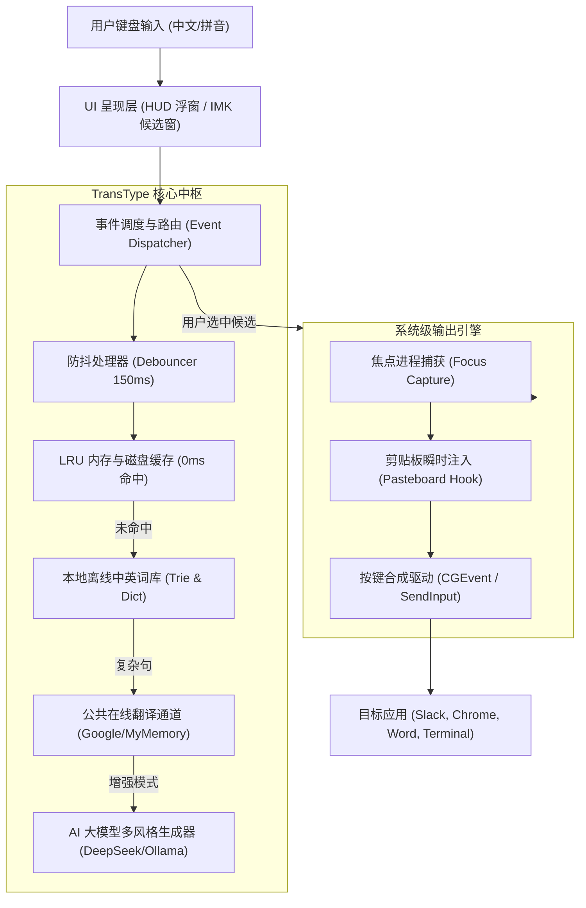

# 🖥️ 电脑智能翻译输入法深度架构设计指南 (ARCHITECTURE.md)

> 本文档详细阐述了在现代操作系统（macOS、Windows、Linux）中开发**“中文输入 -> 选词 -> 英文直接上屏”**翻译输入法的技术选型、底层系统接口、分词与多风格翻译流水线，以及实际工程落地策略。

---

## 目录
1. [产品定位与核心交互范式](#1-产品定位与核心交互范式)
2. [总体分层架构 (System Architecture)](#2-总体分层架构)
3. [macOS 平台实现深度解析](#3-macos-平台实现深度解析)
   - 3.1 方案 A：独立常驻悬浮 HUD 助手 (TransType)
   - 3.2 方案 B：系统原生输入法 (InputMethodKit)
4. [Windows 平台实现深度解析 (TSF 架构)](#4-windows-平台实现深度解析)
5. [跨平台开源输入法扩展方案 (Rime Lua Filter)](#5-跨平台开源输入法扩展方案)
6. [实时翻译与多候选词流水线](#6-实时翻译与多候选词流水线)
7. [焦点恢复与无损上屏策略](#7-焦点恢复与无损上屏策略)

---

## 1. 产品定位与核心交互范式

### 痛点分析
在涉外交流、跨国远程办公、开源协作、英文论文撰写等场景中，中文母语者经常需要用英文表达，但思考语言往往是中文。
传统的处理路径是：
$$\text{思考中文} \rightarrow \text{切到翻译软件} \rightarrow \text{输入中文} \rightarrow \text{选择译文} \rightarrow \text{复制} \rightarrow \text{切回工作软件} \rightarrow \text{粘贴}$$
路径冗长，频繁打断思维流。

### 核心交互规范
1. **即打即译**：用户在任何界面通过极简热键（如 `⌥ + Space`）唤起高颜值半透明毛玻璃浮窗。
2. **多风格候选**：用户输入中文，系统实时生成：
   - **[1] 自然推荐 (Natural)**：地道流畅的通用表达。
   - **[2] 商务正式 (Formal / Business)**：适用于正式邮件、商务合同或学术交流。
   - **[3] 日常口语 (Casual)**：适用于 Slack / Discord / 微信即时沟通。
   - **[4] 精简短语 (Concise)**：提纲挈领的简短表达。
   - **[词汇拆解]**：对句子中的核心实词提供近义词扩展。
3. **选词即上屏**：按下数字键（`1`~`7`）或回车，浮窗隐退，**直接将对应的英文打入当前光标所在的应用**！

---

## 2. 总体分层架构



---

## 3. macOS 平台实现深度解析

在 macOS 上，实现此类输入工具有两种主要技术方案：

### 3.1 方案 A：独立常驻悬浮 HUD 助手 (TransType)
本项目在 `src/macos-app/` 中默认采用此方案。
- **优点**：
  - **保留用户既有输入法习惯**：用户无需牺牲原有拼音输入法的词库与习惯（搜狗、微信输入法、双拼、五笔等），在浮窗内直接使用原生中文输入。
  - **安装零门槛**：普通 `.app`，无需重启或注销登录即可生效。
  - **高拓展性**：界面可做任意自定义（毛玻璃、标签、发音、收藏）。
- **关键技术点**：
  1. **全局快捷键**：使用 Carbon 框架的 `RegisterEventHotKey` 监听系统全局热键（如 `Option + Space`）。
  2. **面板层级**：使用 `NSPanel`，设置 `level = NSFloatingWindowLevel`，`styleMask = NSWindowStyleMaskNonactivatingPanel`，使浮窗不会夺走普通全屏窗口的主控权。
  3. **前台应用记录**：唤起前调用 `[[NSWorkspace sharedWorkspace] frontmostApplication]` 保存目标应用。

### 3.2 方案 B：系统原生输入法 (InputMethodKit)
本项目在 `src/macos-imkit/` 中提供了完整的原生输入法实现。
- **核心类继承**：
  - `IMKServer`：向操作系统 TIS (Text Input Services) 注册连接点。
  - `IMKInputController`：输入法控制器，负责拦截底层原始击键事件：
    ```objc
    - (BOOL)handleEvent:(NSEvent *)event client:(id)sender;
    ```
- **拼音与候选词状态机**：
  - 用户按下字母时，拼音追加到 `compositionBuffer`。
  - 调用 `[sender setMarkedText:...]` 向宿主应用显示带下划线的内嵌拼音。
  - 将拼音输入 `PinyinEngine`，生成带有中文与对应英文的候选词列表。
  - 调起系统 `IMKCandidates` 候选窗呈现候选词（如：`1. 你好 -> Hello`）。
- **英文直接上屏机制**：
  - 用户按空格确认第一候选，或按数字键选中候选。
  - 控制器**不输出中文**，而是直接调用：
    ```objc
    [sender insertText:selectedCandidate.english replacementRange:NSMakeRange(NSNotFound, NSNotFound)];
    ```
  - 清空输入缓冲区并隐藏候选窗，完成原生英文直接替换上屏。

---

## 4. Windows 平台实现深度解析

在 Windows 操作系统中，输入法体系历经两次重大变革：
1. **IMM32 (已淘汰)**：Windows 95~XP 时期的老旧接口。
2. **TSF (Text Services Framework - 现代标准)**：自 Windows Vista / 7 / 10 / 11 沿用至今的 COM 组件化架构。

### 4.1 TSF (Text Services Framework) 架构核心
- **TIP (Text Input Processor)**：输入法作为一个 In-process COM DLL 实现 `ITfTextInputProcessor`。
- **线程管理器 (`ITfThreadMgr`)**：管理输入法的激活与停用。
- **键盘事件过滤 (`ITfKeyEventSink`)**：
  - `OnKeyDown` / `OnKeyUp`：拦截按键。
  - 当检测到汉字拼音输入时，返回 `S_OK` 消费事件并阻止向下传递。
- **文字合成 (`ITfComposition`)**：
  - 管理待定文本（Composition String）。
- **英文上屏 (`ITfContext` / `ITfRange`)**：
  - 当用户选择翻译候选词时，开启写事务（Write Lock）：
  ```cpp
  pRange->SetText(ec, 0, pszEnglishText, cchLength);
  pComposition->EndComposition(ec);
  ```
  - 宿主程序（如 Word, 浏览器）直接接收并渲染英文。

### 4.2 Windows 悬浮助手替代方案 (Global Hook + SendInput)
在 Windows 下若开发类似 TransType 的独立悬浮助手：
- **全局按键监听**：`RegisterHotKey(hWnd, 1, MOD_ALT, VK_SPACE);`
- **上屏模拟**：
  - 使用 `GetForegroundWindow()` 获取前台句柄。
  - 使用 `OpenClipboard` / `SetClipboardData` 写入英文。
  - 调用 `SendInput` 合成 `VK_CONTROL + VK_V` 发送粘贴。

---

## 5. 跨平台开源输入法扩展方案 (Rime Lua Filter)

Rime（中州韵输入法引擎）在 macOS 上对应“鼠须管”，Windows 上对应“小狼毫”，Linux 上对应“Fcitx-Rime”。
Rime 提供了强大的 Lua 扩展接口（参见本项目 `src/rime-plugin/`）：
```lua
function trans_filter(input, env)
    for cand in input:iter() do
        local zh = cand.text
        local translations = dict[zh]
        if translations then
            for i, en in ipairs(translations) do
                -- 将候选词的文字替换为英文，注释标注原中文
                local c = Candidate("trans", cand.start, cand._end, en, " [" .. zh .. "]")
                yield(c)
            end
        else
            yield(cand)
        end
    end
end
```
这种方案将中文分词和拼音转换工作交给成熟的 Rime 引擎，开发者只需编写 Lua 滤镜进行中英映射，选词时由 Rime 自动完成英文上屏！

---

## 6. 实时翻译与多候选词流水线

为了保证“即打即译”无卡顿，流水线采用**分级降级与并发查询策略**：

1. **第 0 级：本地 Trie 树与精准哈希表 (0ms)**
   - 内存预加载高频中英句型与技术/商务词库（`dictionary.json`）。
   - 用户输入精准匹配或前缀命中时，0 延迟返回多风格候选。
2. **第 1 级：LRU 内存高速缓存 (0ms)**
   - 记录用户最近输入过的内容，第二次输入瞬时命中。
3. **第 2 级：防抖控制 (Debounce 150ms~180ms)**
   - 用户连续打字时重置定时器，避免每个击键均发起网络 I/O。
4. **第 3 级：免费在线公共 API (100ms~250ms)**
   - Google / MyMemory 开放翻译端点，多线程异步并发。
5. **第 4 级：AI 大模型语义增强 (选配)**
   - 对接 DeepSeek / OpenAI / Ollama。
   - 通过专门设计的 JSON Prompt，一次往返同时返回：
     - 自然通用风格
     - 商务正式风格
     - 日常口语风格
     - 精简短语风格
     - 核心词汇近义词拆解

---

## 7. 焦点恢复与无损上屏策略

为了确保选定的英文精准落入目标应用，上屏逻辑设计如下时序：

```text
[用户按 1 或 Enter]
       │
       ▼
1. 立即隐退浮窗窗口 (orderOut)
       │
       ▼
2. 激活目标进程 (activateWithOptions:NSApplicationActivateIgnoringOtherApps)
       │
       ▼
3. 延时 80ms (等待目标应用窗口完成重绘并获取键盘焦点)
       │
       ▼
4. 剪贴板安全写入 (保存原剪贴板 -> 写入选定英文)
       │
       ▼
5. 合成 ⌘+V (CGEventPost Command+V 或 AppleScript 备用方案)
       │
       ▼
6. 延时 400ms 异步还原用户原本的剪贴板内容
```

这种策略具备极佳的兼容性，不仅适用于标准 AppKit/UIKit 文本框，也适用于 Electron 应用（VS Code, Slack）、Web 应用（Chrome, Safari）、Java 应用（IntelliJ IDEA）甚至终端窗口！
